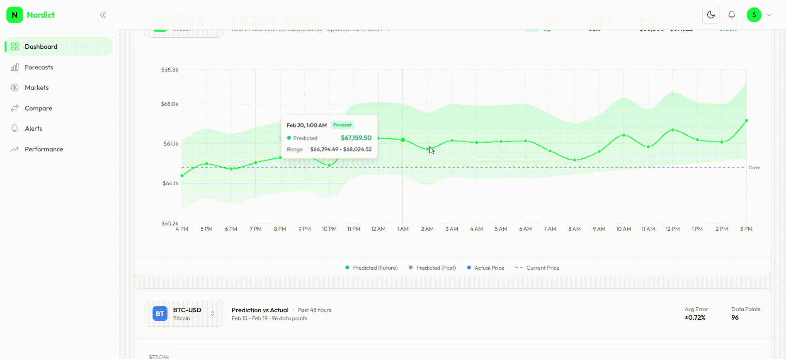

# Nordict

## Cloud-Native Market Forecasting & Decision Support Platform

Nordict is a production-oriented, multi-horizon market forecasting platform designed to generate probabilistic predictions with confidence scoring, transparent performance tracking, and structured decision support.

The system combines machine learning, disciplined validation methodology, and scalable cloud architecture to deliver rolling forecasts across multiple time horizons.

---

## System Architecture


---

## Platform Demo



---

# Vision

Markets are noisy, uncertain, and often misrepresented through overconfident predictions.

Nordict is built around a simple principle:

> Forecasts must be probabilistic, calibrated, and transparently evaluated.

This platform focuses on:

- Multi-horizon forecasting
- Explicit uncertainty representation
- Walk-forward validation
- Clear separation of training vs inference
- Infrastructure built for production from day one

---

# Core Capabilities

- Multi-horizon rolling forecasts (24H, 7D, 4W, 12M)
- Confidence scoring and uncertainty bands
- Backtesting with walk-forward validation
- Live vs historical performance separation
- Alert system based on forecast confidence and directional signals
- Model registry and version tracking
- Modular ML architecture (coin-specific models supported)
- Cloud-native containerized backend

---

# Forecasting Philosophy

## Training

- Models trained offline on historical data
- Scheduled retraining (weekly/monthly)
- Strict time-based splits (no leakage)
- Walk-forward validation discipline

## Inference

- Models remain fixed between retraining cycles
- New market data used only as input
- Forecasts update when new data arrives
- Rolling predictions shift forward over time

## Confidence Behavior

- Near-term predictions: higher confidence
- Long-term predictions: wider uncertainty
- Explicit generation timestamps
- Clear separation between historical and forecasted data

---

# System Architecture

Frontend (Next.js + TypeScript + Tailwind)  
⬇  
Django REST API  
⬇  
PostgreSQL Database  
⬇  
ML Training & Inference Modules  
⬇  
Model Artifacts (S3 in production)

---

# Repository Structure

```
.
├── backend/
│   ├── alerts/
│   ├── config/
│   ├── contact/
│   ├── core/
│   ├── forecasts/
│   ├── markets/
│   ├── ml/
│   ├── users/
│   ├── Dockerfile
│   ├── docker-compose.yml
│   ├── manage.py
│   └── requirements.txt
│
├── frontend/
│   ├── src/
│   ├── public/
│   ├── next.config.ts
│   ├── tailwind.config.ts
│   ├── package.json
│   └── tsconfig.json
│
├── infrastructure/
│   ├── stacks/
│   ├── constructs/
│   ├── diagrams/
│   │   └── architecture.gif
│   ├── app.py
│   ├── cdk.json
│   └── requirements.txt
│
├── demo.gif
│
├── LICENSE
│
└── README.md
```

---

# Tech Stack

## Frontend

- Next.js
- TypeScript
- Tailwind CSS
- Stateless architecture consuming REST APIs

## Backend

- Django
- Django REST Framework
- Dockerized
- Modular app structure (forecasts, markets, alerts, users, ML)

## Machine Learning

- XGBoost (production baseline)
- LSTM (coin-specific implementation)
- Feature engineering (~40–50 indicators)
- Direction accuracy + MAE/RMSE evaluation
- Model artifacts versioned per coin per horizon

## Cloud (Production Target)

- AWS ECS (containers)
- AWS RDS (PostgreSQL)
- AWS S3 (model artifacts + storage)
- CloudFront (frontend delivery)
- EventBridge (scheduling)
- Lambda (light ingestion tasks)
- CloudWatch (monitoring)
- GitHub Actions (CI/CD)

---

# Local Development

## Backend

### 1. Create virtual environment

```bash
cd backend
python -m venv venv
source venv/bin/activate  # Windows: venv\Scripts\activate
```

### 2. Install dependencies

```bash
pip install -r requirements.txt
```

### 3. Run migrations

```bash
python manage.py migrate
```

### 4. Start development server

```bash
python manage.py runserver
```

Backend runs at:
http://localhost:8000

---

## Frontend

### 1. Install dependencies

```bash
cd frontend
pnpm install
```

### 2. Start development server

```bash
pnpm dev
```

Frontend runs at:
http://localhost:3000

---

# Model Strategy

## LSTM Design Decisions

- One model per coin per horizon
- Predict returns (not raw price)
- 80/20 time-based split
- 3–5 years historical data
- Sequence length: 24–168 hours
- 40–50 engineered features
- Hyperparameter tuning (layers, units, dropout, learning rate)
- Direction accuracy prioritized
- Fallback to XGBoost if no coin-specific LSTM exists

---

# Product Structure (Logged-In)

- Dashboard
- Forecasts (Overview + Market Detail)
- Performance (Backtesting + Live Tracking)
- Alerts
- Markets
- Models (Registry)
- Settings

Each page uses:

- Shared layout
- Dynamic header (title + subtitle)
- Consistent SaaS-style navigation

---

# Roadmap

- Webhook alert delivery
- Automated retraining pipelines
- Drift detection
- Regime-based evaluation views
- API access by subscription tier
- Institutional collaboration features

---

# Disclaimer

This platform provides probabilistic forecasts for research and decision-support purposes.  
It does not provide financial advice. All forecasts include uncertainty and are not guarantees.
